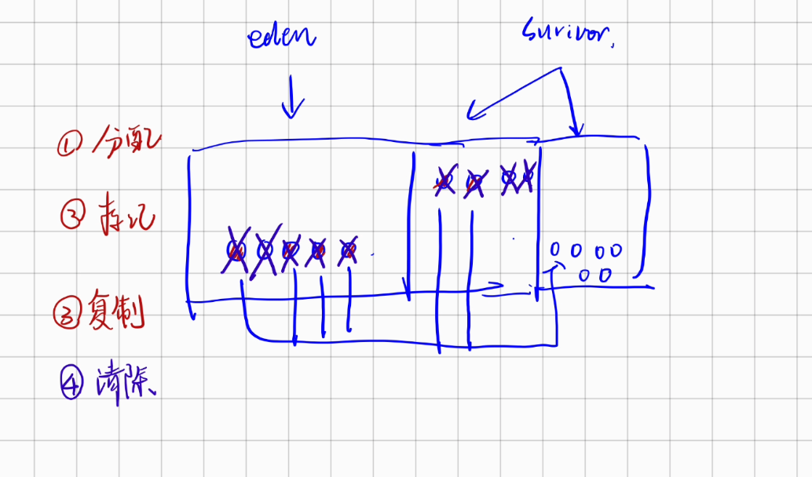

# GC

## 1 GC要解决的问题
### 1.1 在哪里进行
GC一般在方法区和堆区进行，因为两个栈和程序计数器都是随着线程的生命周期开始而开始、结束而结束，所以不会在这些地方GC。

同时由于堆区和方法区所确定的大小是程序运行的才能确定的，所以就没有办法提前分配好空间，它的内存是动态的，所以GC在这里进行。

### 1.2 什么时候回收

### 1.3 怎么回收

## 2 如何判断对象已死
### 2.1 引用计数
类似于C++的智能指针，但是会有相互引用导致无法GC的情况。

### 2.2 可达性分析
通过一个根对象来找到其引用链，如果某个对象不可达，说明对象已死。

可以作为GC root：
+ 虚拟机栈中的引用对象
+ 静态类属性引用对象
+ 常量引用对象
+ 本地方法引用对象
+ 等等

## 3 垃圾回收算法
### 3.1 分代回收理论
根据被回收对象的年龄（熬过GC周期）来分为不同的区域，以进行不同频次的垃圾回收。

+ 弱分代假说：大部分对象都是朝生夕灭的
+ 强分代假说：熬过越多次垃圾收集过程的对象就越难以消亡
+ 跨代引用假说：跨代引用相对于同代引用来说仅占极少数 （可推出可以将跨代引用的对象额外划分一个数据结构(rememberd set)进行GC）

部分收集(partial gc)：分为
+ 新生代收集(minor gc/young gc)
+ 老年代收集(major gc/old gc)
+ 混合收集(mix gc)：整个新生代 + 部分老年代

整堆收集(full gc)

### 3.2 标记-清除算法
两种实现：
1. 标记可回收，清除标记对象
2. 标记不可回收，清除非标记对象
缺点：
1. 内存间隙
2. 大量的标记开销过大

### 3.3 标记-复制算法
将区域划分为两块，每次只使用其中一块，标记不可回收的，复制到另一块内存区域，完全回收原内存区域。
缺点：

1. 不可回收的对象过多会导致复制开销大
2. 浪费内存，每次只能用一半

目前主流的内存回收算法采用了这种算法的优化版本：
apple 回收：

1. 划分1个eden 2个survivor 区域
2. 分配时分配到eden + 1个survivor区域中
3. 回收时候标记不可回收
4. 复制不可回收对象到未分配的survivor区域中
5. 清除区域
6. 当复制的对象过多的时候放不到survivor区域中后，就会触发分配担保，使其直接进入老年代区域



### 标记-整理算法
和标记-清除算法类似，但是该算法会将所有存活对象移动到一端，然后根据边界来清除可回收对象，一般用于老年代。

缺点：
1. 花销极大，但是可以有效利用空间

## 4 HotSpot 算法细节实现

### 4.1 根节点枚举

### 4.2 安全点

### 4.3 安全区域

### 4.4 记忆集与卡表

卡表是记忆集的实现方式，每一个CARD标记一个小的内存区域，如果这个CARD为1则说明该区域存在跨代指针，从而很容易地找到记忆集。


#### 4.5 写屏障 

卡表的维护也很简单，在一个对象被新对象引用的时候，直接在对应对象的内存区域的卡表赋值1即可。

写屏障优化：卡表写入前检查是否被写过。可以避免伪共享问题。


#### 4.6 并发可达性分析
三色标记
1. 白色，未扫描过的
2. 黑色，已经经过扫描且经历了GC
3. 灰色，至少有一个引用(还能至少再扩展一圈)
对象消失

满足对象消失的两个条件：
1. 黑色指向白色 (黑色无法到达白色)
2. 删除了灰色指向白色 (灰色无法到达白色)

破坏条件的解决方法：
1.【增量更新】 记录黑色指向白色的修改(记录修改后的引用)，后续将这些黑色作为根重新扫描
2.【原始快照】 记录灰色删除指向白色的修改(记录修改前的引用)，后续将这些灰色作为根重新扫描


## 5 实战
一些Jvm的参数指令：
``-Xms20M``：设置堆大小20M，
``-Xmx20M``：设置堆扩展最大到20M
``-Xmn10M``：设置新生代区域大小10M

### 5.1 对象优先在Eden分配
```java
private static final int _1MB = 1024 * 1024;
/**
* VM参数：-verbose:gc -Xms20M -Xmx20M -Xmn10M -XX:+PrintGCDetails -XX:SurvivorRatio=8
* 新生代 ：Eden:survivor1：survivor2 = 8：1：1
*/
    public static void testAllocation() {
    byte[] allocation1, allocation2, allocation3, allocation4;
    allocation1 = new byte[2 * _1MB];
    allocation2 = new byte[2 * _1MB];
    allocation3 = new byte[2 * _1MB];
    allocation4 = new byte[4 * _1MB]; // 出现一次Minor GC
}
```
### 5.2 大对象直接进入老年代
利用参数``-XX：PretenureSizeThreshold``设置大于某个阈值的大对象直接分配在老年代，可以省略复制的开销

### 5.3 长期存活对象进入老年代
每一次熬过GC的年轻代对象都会增加年龄，年龄到达一定程度会到达到年代，可以通过参数``-XX：M axTenuringThreshold``设置

### 5.4 动态对象年龄判定
如果在Survivor空间中相同年龄所有对象大小的总和大于Survivor空间的一半，年龄大于或等于该年龄的对象就可以直接进入老年代

### 5.5 空间分配担保
如果年轻代无法全部晋升 ->Minor GC会查看参数``XX：HandlePromotionFailure``判断是否允许担保失败 ->允许则继续检查老年代最大可用的连续空间是否大于历次晋升到老年代对象的平均大小->大于就进行，小于或者不允许冒险就进行FULL GC再进行。